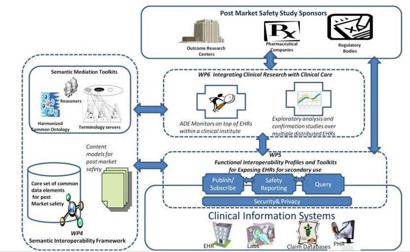
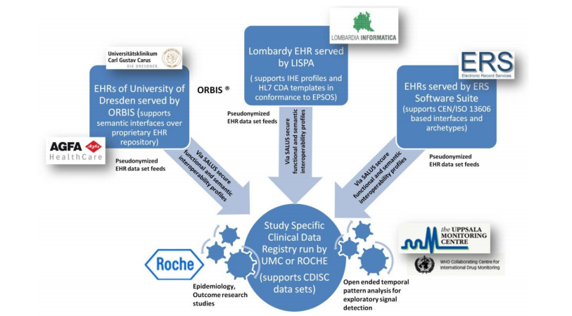

D1.1.9 Project presentation		
==============
项目编号：287800		

项目名称简写：SALUS		

完整项目名称：针对可持续前瞻性上市后安全研究的可扩展的标准化互操作性框架		

重点：ICT-2011.5.3b 健康档案/电子病历数据分析利用的工具和环境		

预计成本：500万多一点欧		

参与机构：SRDC(土耳其),EUROREC(法国),UMC(瑞典),OFFIS(德国),AGFA(比利时),ERS(荷兰),LISPA(意大利),INSERM(法国),TUD(德国),ROCHE(瑞士)		

赞助方：European Union’s Seventh Framework Programme	

起止日期：2012/02/01-2015/01/31	
##	项目的目标：		
III期临床试验(Pre-approval clinical trials)无法确保药物上市后不会有严重的不良反应。IV期临床试验(Post-approval  drug  safety  data  studies)旨在考察在广泛使用条件下的药物的疗效和不良反应、评价在普通或者特殊人群中使用的利益与风险关系以及改进给药剂量等。但IV期临床试验的效率一直是老生常谈的问题，只要原因在于现在的IV期临床试验数据依赖的是自发的个案上报，但不报和漏报是主要问题。	急需一种更加有效的方式，能够及时对多个数据源进行监控，进行关联和分析。临床科研系统与电子健康档案/电子病历的整合能够很好的改善IV期临床试验的效果(对于国内的情况而言，则是EMR/EHR院内信息系统与公卫系统的整合 或者说区域卫生平台与公卫平台的业务联动？)
该项目中希望通过如下来实现这一目标：		

*	提供临床科研系统与EHR系统之间进行数据通信和交换的功能规范和开源软件		
*	提供能够有效解读所交换的EHR数据的语义互操作性解决方案的实现		
*	提供能够确保医学信息以安全、符合法律伦理的方式进行共享的安全隐私机制的实现		
*	提供基于异构的分布式EHR系统的IV期临床研究的开放式Temporal pattern discovery的探索性数据分析框架			

##	技术方法			
		
从图中看出总共4块：	

*	IV期临床试验的赞助方：疗效研究的科研中心、药企、政府机构	
*	WP6临床科研与医疗服务的整合：医疗机构内部基于EHR的ADE监控、基于分布式EHR的跨机构的探索性分析和确认性研究	
*	WP5 EHR数据二次利用的功能规范和工具包：最底层的是各个业务系统(HIS LIS PACS EHR PHR 医保)，在此之上是数据安全和隐私保护，在此之上是数据的发布订阅，安全事件的报表，数据的查询
*	WP4语义互操作性框架：用于临床试验的数据集、具体应用场景所对应数据的内容模型、语义mediation工具包(统一的本体、推理机和相应的术语服务/术语服务器)		

预期效果：	

*	院内利用自动化ADE检测工具做EHR筛检来改进自发上报的流程，减轻原有的工作量，提高数据准确性。
*	ADE上报过程中自动的从EHR中提取数据生成个案报告，减少数据重复录入。		
*	在SRS自发上报系统中心，改进现有信号检测流程，追踪个案病例，计算绝对上报率，从相应的病历中获取患者额外的病史信息。  
*	实现异构分布式EHR系统中的ADE信号早期检测的实时筛检		
*	实现可持续的可扩展的EHR复用框架，能够完成大规模疗效和效率研究。在一个时间段内对患者队列进行观察，分析确定药物的航期的安全问题	
*	实现从异构分布式EHR中选取不同的样本来进行IV期临床研究。主要在可及性和安全性之间进行权衡取舍。这样我们就能够确定不良反应只是发生在一小撮人群之中，这样子，药物就可以继续在没有发生不良反应的那些人身上进行使用。	

目标————实现手段		

目标1————通用的传输协议	
	
目标2————分析IV期临床试验数据需求，分析现有的临床科研中所用到的数据集数据元，用SALUS本体表示它们，并将其与其他的领域本体术语关联起来；		

目标2————基于SALUS统一本体开发针对IV期临床试验的Semantic Mediation Mechanism 	

目标3————提供授权、认证、匿名化、审计的开源工具以满足安全、隐私的要求		
		
		

期望所达到的效果：	

*	改善临床科研社区、团队的数据可及性	
*	改善手动ADE上报的数据准确性数据质量		
*	减少个案病例上报时数据重复录入的工作量	
*	支撑长期的大规模的观察性研究，在比较效果研究时能够访问异构分布式EHR系统中的临床信息		
*	减少检测不良反应事件的时间(当能够访问EHR系统之后，研究规模会变大)		
*	促进更多的医务人员和医疗机构参与到研究当中		
*	避免撤回药物带来的法律诉讼成本		

		

