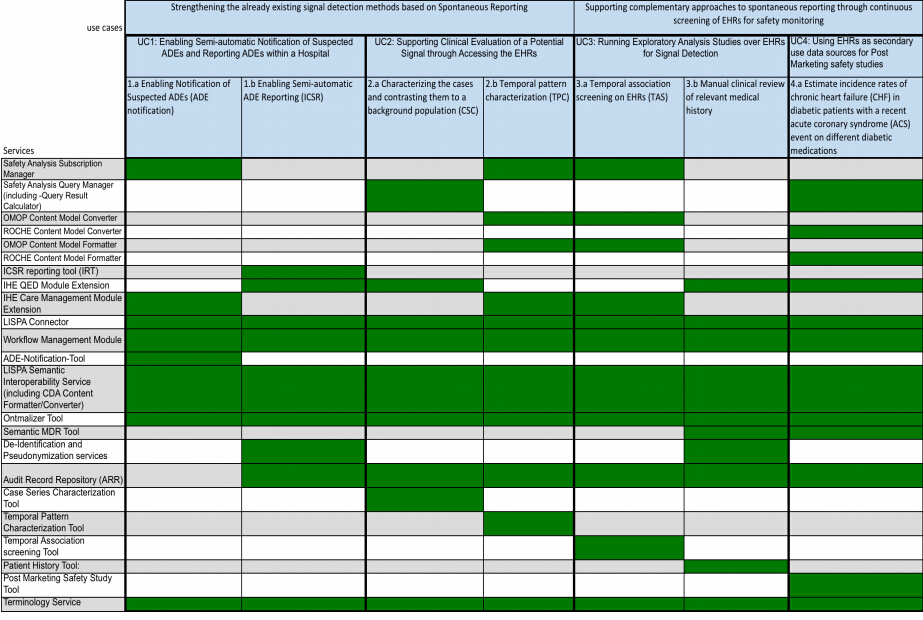

D2.3.1 知识产权协议	
==============

目录	
	
1.简介		

2.知识产权声明	

2.1 BackGROUND CLAIMS		

2.1.1  SRDC	

2.1.2  Roche 	

2.1.3  LISPA		

2.1.4  TUD		

2.1.5  OFFIS

2.1.6  EuroRec		

2.1.7  ERS		

2.1.8  AGFA	

2.1.9  UMC		

2.1.10 INSERM	

2.2 FOREGROUND CLAIMS	
2.2.1 开源		

2.2.2 应用场景、用例		

2.2.3 开源的内容有哪些	

2.2.4 开源组件如何组织	

这是D2.3.1的第二版，与第一版的不同之处在于：

	这一版是对第一版的扩展. 大部分内容都是一样的。 变化总结如下：
	1-  Background IP: only a small change from ERS 
	2-  Foreground IP: the list of SALUS results and software components are updated to the 	current status of the technical work. Further, the SALUS use cases are decomposed in 	a concrete list of software components 
	3-  Small changes have been made on the partner’s contributions and IP-plans, making 
	the document more accurate and aligned with the actual technical work done. 
	4-  Lastly, the consortium made a decision as to how it wants to publish the software code of the components defined as open source. 
	 
	This document doesn’t contain everything related to IPR. Both the Commercial Exploitation 
	Plan (D2.1.*) and the Non-Commercial Exploitation Plan (D2.2.*) are related to it as well. We 
	refer to these deliverables rather than copying the content in the current document. 
		
关于开源代码库的发布问题（看起来是不会把代码都拿出来了）	

	The SALUS consortium wishes to contribute to the general advance in Health Care IT and therefore opens a great part of its project results to the community, both in terms of dissemination and in terms of concrete software code. However, being a small consortium 	with a limited project lifetime and fearing a lack of resources to maintain a formal open source 	project, the consortium decided to “keep code available” for interested parties without the 
	overhead of a formal open source project. 
	 
	No patents are currently considered, other than the ones identified as the background IP. However, the consortium still wants to exploit the SALUS results by actually establishing and running services supporting the SALUS use cases. We refer to the exploitation deliverables (D2.1.*) for more information. 
